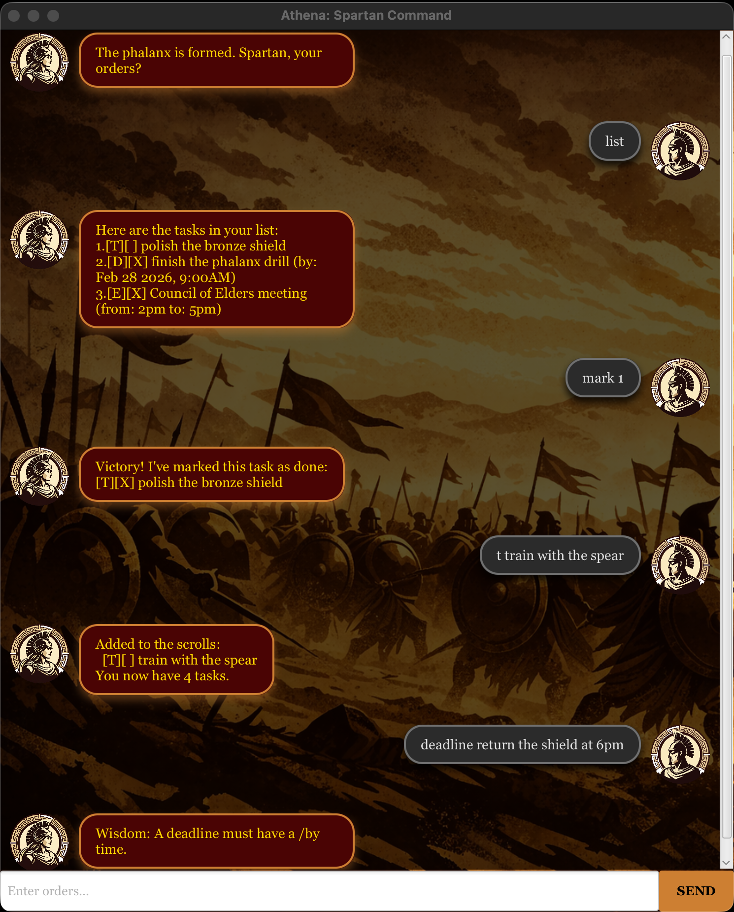

# Athena - User Guide

---

**Athena** is a tactical task manager designed for the disciplined Spartan. Whether you are preparing for a campaign or organizing your daily scrolls, Athena helps you track your tasks with military precision.

## Features

---

> **Notes about the command format:**
>
> - Words in `UPPER_CASE` are the parameters to be supplied by the user, 
> 
>   e.g. in `todo DESCRIPTION`, `DESCRIPTION` can be used as `todo Sharpen spear`.
>
> 
> - Parameters for `deadline` and `event` must follow the specified keywords (`/by`, `/from`, `/to`).
>
> 
> - Extraneous parameters for commands that do not take parameters (`list`, `bye`) are ignored.
>
>   e.g. `list all` is interpreted as `list`.

### 1. View the Scrolls: `list`
Shows all tasks currently recorded in your phalanx.
* **Format:** `list` or `l`
* **Expected Output:** A numbered list showing the status and description of your tasks.

### 2. Add a Todo: `todo`
Adds a general task to your scrolls without a specific deadline.
* **Format:** `todo DESCRIPTION` or `t DESCRIPTION`
* **Example:** `t Polish the bronze shield`

### 3. Add a Deadline: `deadline`
Adds a task that must be completed by a specific time.
* **Format:** `deadline DESCRIPTION /by yyyy-mm-dd HHmm` or `d DESCRIPTION /by yyyy-mm-dd HHmm`
* **Example:** `d Return the shield /by 2026-03-01 1800`

### 4. Add an Event: `event`
Adds a task with a specific start and end time.
* **Format:** `event DESCRIPTION /from START /to END` or `e DESCRIPTION /from START /to END`
* **Example:** `e Council of Elders /from 2pm /to 5pm`

### 5. Mark Victory: `mark`
Marks a task as completed.
* **Format:** `mark INDEX` or `m INDEX`
* **Example:** `m 1`

### 6. Retract Victory: `unmark`
Marks a task as not done yet.
* **Format:** `unmark INDEX` or `u INDEX`
* **Example:** `u 2`

### 7. Remove from Records: `delete`
Removes a task permanently from the scrolls.
* **Format:** `delete INDEX` or `del INDEX`
* **Example:** `del 3`

### 8. Search the Scrolls: `find`
Finds tasks that contain a specific keyword.
* **Format:** `find KEYWORD` or `f KEYWORD`
* **Example:** `f shield`

### 9. Exit: `bye`
Closes the command interface and preserves your scrolls.
* **Format:** `bye` or `b`

## FAQ

---

**Q: Where are my tasks saved?** 
**A:** Your tasks are stored automatically in `./data/athena.txt` every time you modify the list.

**Q: What happens if I use the wrong date format?** 
**A:** Athena will provide "Wisdom" by reminding you to use the `yyyy-mm-dd HHmm` format for deadlines.
